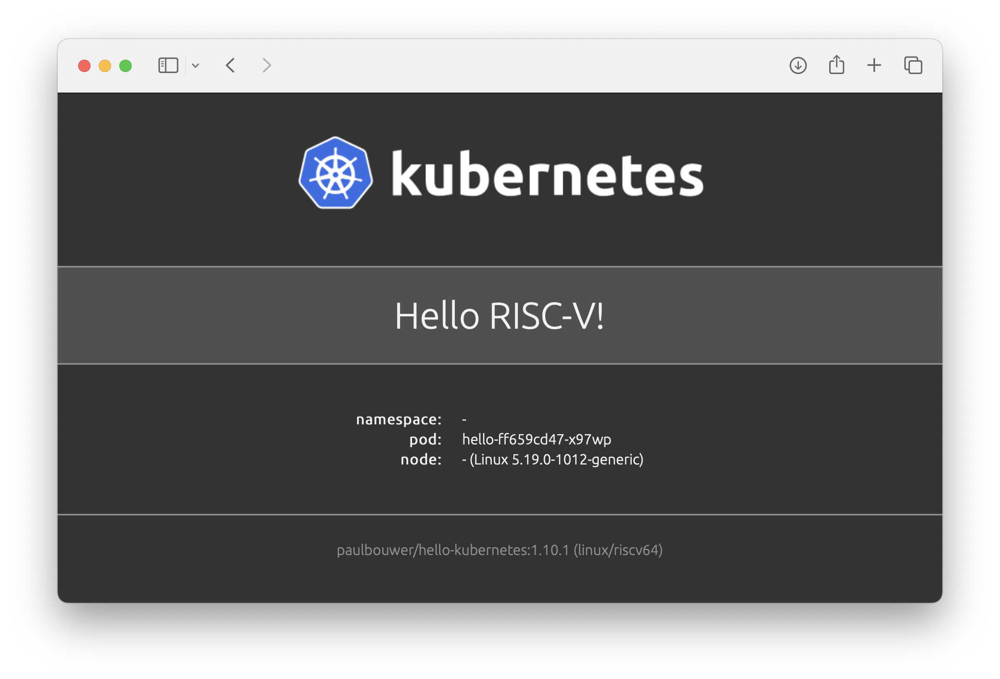

# Kubernetes on RISC-V

As of mid-2023, Debian and Ubuntu Linux run on RISC-V, with container support enabled in the kernel by default, however lack Kubernetes binaries. [Previous work](https://github.com/carlosedp/riscv-bringup) in the direction of running containers and Kubernetes on RISC-V indicates that it is possible. Back then, Golang support for RISC-V was at “experimental” status; now RISC-V is fully supported, so cross-compiling to the new architecture should be easier.

This document marks our current progress in making Kubernetes available for RISC-V.



## Running

In summary, the following commands should get you up and running with K3s:
```bash
# Download
wget https://github.com/CARV-ICS-FORTH/k3s/releases/download/20230721/k3s-riscv64.gz.aa
wget https://github.com/CARV-ICS-FORTH/k3s/releases/download/20230721/k3s-riscv64.gz.ab
wget https://github.com/CARV-ICS-FORTH/k3s/releases/download/20230721/k3s-riscv64.gz.ac
cat k3s-riscv64.gz.* | gunzip > /usr/local/bin/k3s
chmod +x /usr/local/bin/k3s

# Install
curl -sfL https://get.k3s.io > k3s-install.sh
INSTALL_K3S_SKIP_DOWNLOAD="true" bash -x k3s-install.sh
```

> **Note**
> Most container images are not available for RISC-V, so many applications may not run.

Check the `examples` folder for sample applications:
```bash
kubectl apply -f https://raw.githubusercontent.com/CARV-ICS-FORTH/kubernetes-riscv64/main/examples/hello-kubernetes.yaml
```

To install Argo Workflows:
```bash
kubectl create namespace argo
kubectl apply -n argo -f https://raw.githubusercontent.com/CARV-ICS-FORTH/kubernetes-riscv64/main/argo-workflows/install.yaml
```

## K3s

[K3s](https://k3s.io/) is a light-weight Kubernetes distribution that packs all necessary code into a single binary and needs a smaller memory footprint to run.

To cross-compile K3s to RISC-V, we also had to make required changes in its dependencies [k3s-root](https://github.com/k3s-io/k3s-root) (the base user space binaries for K3s) and [runc](https://github.com/opencontainers/runc) (the tool that runs the containers).

Here is a list of submitted PRs:
- [Add support for RISC-V](https://github.com/k3s-io/k3s/pull/7778) in K3s
- [Support RISC-V](https://github.com/k3s-io/k3s-root/pull/60) in k3s-root - *Merged, released in v0.13.0*
- [Backport riscv64 support into 1.1.x](https://github.com/opencontainers/runc/pull/3905) in runc - *Merged, released in v1.1.8*

Until RISC-V support is merged upstream in K3s, we maintain a [fork](https://github.com/CARV-ICS-FORTH/k3s) with [precompiled binaries](https://github.com/CARV-ICS-FORTH/k3s/releases). The binaries are built from the `riscv64-manifests` branch, that also uses available `riscv64` container images by default.

We build K3s with:
```bash
# Build
rm -rf bin etc dist build
ARCH=riscv64 SKIP_IMAGE=true SKIP_VALIDATE=true SKIP_AIRGAP=true make

# Split
cd dist/artifacts
gzip < k3s-riscv64 | split -b 20M - k3s-riscv64.gz.
```

## Supporting services and container images

K3s relies on several additional services and applications, which have been ported to RISC-V:
- [Add support for RISC-V](https://github.com/coredns/coredns/pull/6195) in CoreDNS - *Merged, released in v1.11.0*
- [Add support for RISC-V](https://github.com/rancher/local-path-provisioner/pull/346) in Local Path Provisioner
- [Add support for RISC-V](https://github.com/helm/helm/pull/12204) in Helm
- [Add support for RISC-V](https://github.com/k3s-io/klipper-helm/pull/64) in klipper-helm
- [Add support for RISC-V](https://github.com/traefik/traefik/pull/10026) in Traefik - *Merged, released in v2.10.5*
- [Add support for RISC-V](https://github.com/k3s-io/klipper-lb/pull/56) in klipper-lb

To build and upload the CoreDNS image from our fork, we comment out building `amd64` and `arm64` binaries in `Makefile.release` and run:
```bash
make -f Makefile.release build
mkdir -p build/docker/riscv64
cp build/linux/riscv64/coredns build/docker/riscv64/
make DOCKER=carvicsforth VERSION=1.10.1 -f Makefile.docker docker-build
docker tag docker.io/carvicsforth/coredns:riscv64-1.10.1 docker.io/carvicsforth/coredns:1.10.1
docker push carvicsforth/coredns:1.10.1
```

To build and upload the Local Path Provisioner image from our fork, we run:
```bash
ARCH=riscv64 SKIP_TEST=1 SKIP_VALIDATE=1 make ci
docker tag rancher/local-path-provisioner:7e1d2a1-riscv64 carvicsforth/local-path-provisioner:master-head
docker push carvicsforth/local-path-provisioner:master-head
```

To build and upload the klipper-helm image from our fork, we run:
```bash
ARCH=riscv64 make
docker tag rancher/klipper-helm:dev carvicsforth/klipper-helm:v0.8.0-build20230716
docker push carvicsforth/klipper-helm:v0.8.0-build20230716
```

To build and upload the klipper-lb image from our fork, we run:
```bash
ARCH=riscv64 make
docker tag rancher/klipper-lb:dev carvicsforth/klipper-lb:v0.4.4
docker push carvicsforth/klipper-lb:v0.4.4
```

Other necessary container images, like the `pause`, `traefik`, and `metrics-server` containers, can be found in the `images` folder.

## Higher level services and applications

Higher level services ported to RISC-V:
- [build: Add support for RISC-V](https://github.com/argoproj/argo-workflows/pull/12067) in Argo Workflows

To compile the Argo CLI for RISC-V, download our [riscv64 branch of argo-workflows](https://github.com/CARV-ICS-FORTH/argo/tree/riscv64) and run:
```bash
make dist/argo-linux-riscv64
```

To try it out:
```bash
cp /etc/rancher/k3s/k3s.yaml ~/.kube/config
argo submit -n argo --watch https://raw.githubusercontent.com/CARV-ICS-FORTH/kubernetes-riscv64/main/argo-workflows/hello-world.yaml
```

Other applications ported to RISC-V:
- [Build multi-arch images locally, including ARM and RISC-V](https://github.com/paulbouwer/hello-kubernetes/pull/46) in Hello Kubernetes

## Acknowledgements

This project has received funding from the European Union’s Horizon Europe research and innovation programme through projects RISER ("RISC-V for Cloud Services", GA-101092993), AERO ("Accelerated EuRopean clOud", GA-101092850) and from the Key Digital Technologies Joint Undertaking through project REBECCA ("Reconfigurable Heterogeneous Highly Parallel Processing Platform for safe and secure AI", GA-101097224). KDT JU projects are jointly funded by the European Commission and the involved state members (including the Greek General Secretariat for Research and Innovation).
