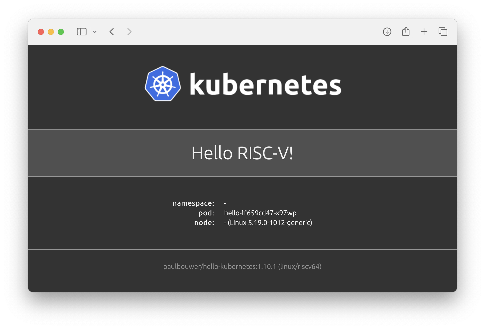

# Kubernetes on RISC-V

This document and repository marks our progress in making Kubernetes available for RISC-V. Our main focus has been to support [K3s](https://k3s.io/); a light-weight Kubernetes distribution that packs all necessary code into a single binary and needs a smaller memory footprint to run.

We started back in mid-2023, when mainline Debian and Ubuntu Linux had RISC-V versions, however the adoption of the architecture in container images was extremely limited. As Kubernetes is mostly written in Go, and Go supports cross-compilation to RISC-V, our first approach was to cross-compile K3s. This also involved dealing with several dependencies out of the K3s tree, both utilities/libraries used by K3s, as well as services launched in containers when booting up K3s. All of our changes were submitted as PRs to the corresponding projects and most have been merged upstream, strengthening Kubernetes RISC-V support.

As of mid-2026, K3s builds natively on RISC-V (using an emulator), however an official build is still not included in the releases and some supporting images are missing `riscv64` architecture variants.



## Running

The following commands should get you up and running with K3s:
```bash
# Download
curl -L -o /usr/local/bin/k3s.2 https://github.com/CARV-ICS-FORTH/k3s/releases/download/20260817/k3s-riscv64
chmod +x /usr/local/bin/k3s

# Install
curl -sfL https://get.k3s.io > k3s-install.sh
INSTALL_K3S_SKIP_DOWNLOAD="true" bash -x k3s-install.sh
```

Check the `examples` folder for sample applications:
```bash
kubectl apply -f https://raw.githubusercontent.com/CARV-ICS-FORTH/kubernetes-riscv64/main/examples/hello-kubernetes.yaml
```

## K3s

We used to cross-compile K3s to RISC-V. Here is a list of submitted PRs:
- [Add support for RISC-V](https://github.com/k3s-io/k3s/pull/7778) in K3s
- [Support RISC-V](https://github.com/k3s-io/k3s-root/pull/60) in k3s-root - *Merged, released in v0.13.0*
- [Backport riscv64 support into 1.1.x](https://github.com/opencontainers/runc/pull/3905) in runc - *Merged, released in v1.1.8*

After K3s's transition to buildx, `riscv64` has been added to the `Makefile`. To build, we use an Ubuntu 26.04 RISC-V VM (instructions are [here](https://ubuntu.com/hardware/docs/boards/how-to/ubuntu_supported/qemu-riscv/)):
```bash
# Prepare

# Run as root
apt-get update
apt-get install -y docker.io make
usermod -aG docker ubuntu

# Run as ubuntu, logout & login
mkdir -p ~/.docker/cli-plugins/
wget https://github.com/gounthar/docker-for-riscv64/releases/download/buildx-v0.36.1-riscv64/docker-buildx
mv docker-buildx ~/.docker/cli-plugins/
chmod +x ~/.docker/cli-plugins/docker-buildx

# Build
git clone --depth 1 --branch riscv64-release-20260817 https://github.com/CARV-ICS-FORTH/k3s.git
cd k3s
make binary # Result in dist/artifacts
```

Until the K3s team produces releases for RISC-V, we maintain a [fork](https://github.com/CARV-ICS-FORTH/k3s) with [precompiled binaries](https://github.com/CARV-ICS-FORTH/k3s/releases). Each binary is built from the respective `riscv64-release-*` branch that uses `riscv64` container images.

## Supporting services and container images

K3s relies on several additional services and applications, which needed porting to RISC-V. Here is a list of submitted PRs:
- [Add support for RISC-V](https://github.com/coredns/coredns/pull/6195) in CoreDNS - *Merged, released in v1.11.0*
- [Add support for RISC-V](https://github.com/rancher/local-path-provisioner/pull/346) in Local Path Provisioner - *RISC-V support added in v0.0.29*
- [Add support for RISC-V](https://github.com/helm/helm/pull/12204) in Helm - *Merged, released in v3.14.0*
- [Add support for RISC-V](https://github.com/k3s-io/klipper-helm/pull/64) in klipper-helm - *RISC-V support added in v0.12.0*
- [Add support for RISC-V](https://github.com/traefik/traefik/pull/10026) in Traefik - *Merged, released in v2.10.5*
- [Add support for RISC-V](https://github.com/k3s-io/klipper-lb/pull/56) in klipper-lb - *RISC-V support added in > v0.4.17*

As of mid-2026, the most significant issue is container images that do not yet support the architecture:
* `pause` requires both [a change in its build process](https://github.com/kubernetes/kubernetes/pull/141291), as well as [the container image that is used to build it](https://github.com/kubernetes/release/pull/4489).
* `mirrored-library-busybox` [still does not support RISC-V, even if the upstream image does](https://github.com/rancher/artifact-mirror/issues/1439).
* `klipper-lb` [already supports `riscv64`](https://github.com/k3s-io/klipper-lb/pull/89), but this is currently not yet part of a release.
* `metrics-server` requires a [simple `Makefile` addition to build for `riscv64`](https://github.com/kubernetes-sigs/metrics-server/pull/1858).

We provide `riscv64` versions of these containers in [our Docker Hub](https://hub.docker.com/u/carvicsforth).

To build and upload the `pause`, we first run the following inside `images/build/cross` in our `release` repo fork:
```bash
REGISTRY=carvicsforth make container
```

This builds the `carvicsforth/kube-cross-arm64:v1.37.0-go1.26.5-trixie.0` container locally, which is then used to build `pause` from our `kubernetes` repo fork, while inside `build/pause`:
```bash
REGISTRY=carvicsforth KUBE_CROSS_IMAGE=carvicsforth/kube-cross-arm64 KUBE_CROSS_VERSION=v1.37.0-go1.26.5-trixie.0 make all-push
```

Similar for the `metrics-server` container (use our fork):
```bash
REGISTRY=carvicsforth make push-all
```

While for `klipper-lb` just re-build for `riscv64` using the original codebase:
```bash
docker buildx build --push --platform linux/riscv64 --tag carvicsforth/klipper-lb:v0.4.17 .
```

## Higher level services and applications

Higher level services ported to RISC-V:
- [build: Add support for RISC-V](https://github.com/argoproj/argo-workflows/pull/12067) in Argo Workflows

To compile the Argo CLI for RISC-V, download our [riscv64 branch of argo-workflows](https://github.com/CARV-ICS-FORTH/argo/tree/riscv64) and run:
```bash
make dist/argo-linux-riscv64
```

Then, install Argo Workflows and try it out:
```bash
kubectl create namespace argo
kubectl apply -n argo -f https://raw.githubusercontent.com/CARV-ICS-FORTH/kubernetes-riscv64/main/argo-workflows/install.yaml

cp /etc/rancher/k3s/k3s.yaml ~/.kube/config
argo submit -n argo --watch https://raw.githubusercontent.com/CARV-ICS-FORTH/kubernetes-riscv64/main/argo-workflows/hello-world.yaml
```

Other applications ported to RISC-V:
- [Build multi-arch images locally, including ARM and RISC-V](https://github.com/paulbouwer/hello-kubernetes/pull/46) in Hello Kubernetes

## Acknowledgements

This project has received funding from the European Union’s Horizon Europe research and innovation programme through projects RISER ("RISC-V for Cloud Services", GA-101092993), AERO ("Accelerated EuRopean clOud", GA-101092850) and from the Chips Joint Undertaking through project REBECCA ("Reconfigurable Heterogeneous Highly Parallel Processing Platform for safe and secure AI", GA-101097224). Chips JU projects are jointly funded by the European Commission and the involved state members, including the Greek General Secretariat for Research and Innovation.
